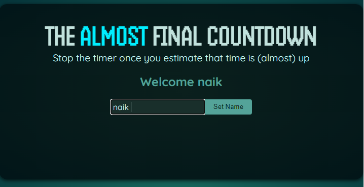
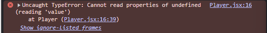
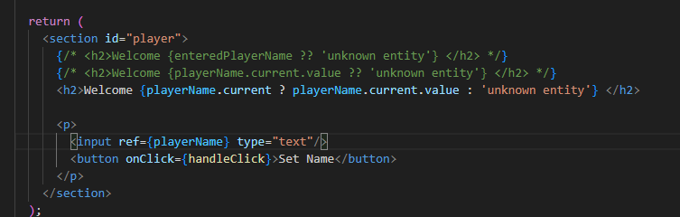
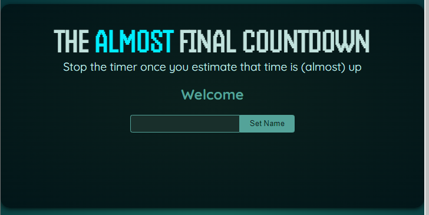
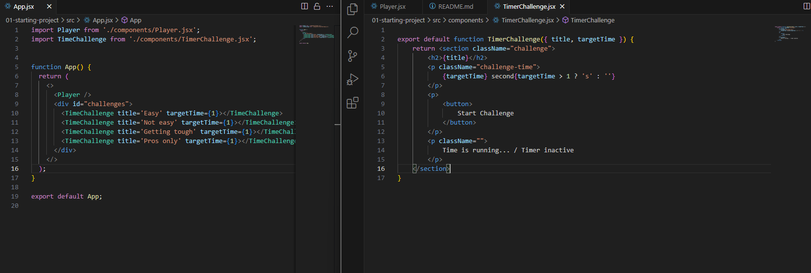
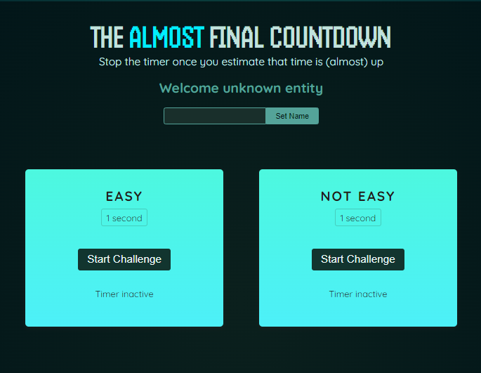
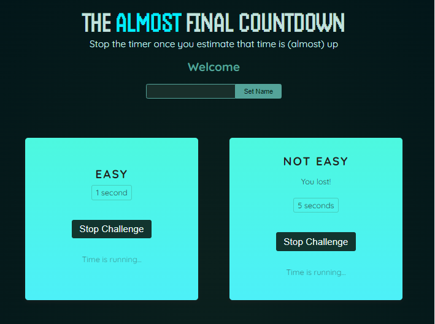

### Done until lecture 143.

<h1>131. Repetition: Managing User Input with State (Two-Way-Binding)</h1>
Here we will know how we will change the some text in the ui based on State.</br>
But this way takes many State to handle the change just the text, as seen below...


Just to change this unkown title and set it to user input we have to write this lengthy code.. 

```jsx
import { useState } from "react";

export default function Player() {
  const [enteredPlayerName, setEnteredPlayerName] = useState('');
  const [submitted, setSubmitted] = useState(false);

  function handleClick(event){
    setSubmitted(false);
    setEnteredPlayerName(event.target.value);
  }

  function handleSubmit(){
    setSubmitted(true);
  }

  return (
    <section id="player">
      <h2>Welcome {submitted? enteredPlayerName : 'unknown entity'} </h2>
      <p>
        <input onChange={handleClick} type="text" value={enteredPlayerName}/>
        <button onClick={handleSubmit}>Set Name</button>
      </p>
    </section>
  );
}
```

<h1>133. Introducing Refs: Connecting & Accessing HTML Elements via Refs</h1>
As we saw above that way takes multiple states for the desired functionality. </br>
But Refs can help us do that in an optimal way. Let see how... 

We have to import useRef from react. </br>

```jsx
import { useState, useRef } from "react";

export default function Player() {
  const playerName = useRef();

  const [enteredPlayerName, setEnteredPlayerName] = useState(null);

  function handleClick(){
    setEnteredPlayerName(playerName.current.value);
  }

  return (
    <section id="player">
      <h2>Welcome {enteredPlayerName ?? 'unknown entity'} </h2>
      <p>
        <input ref={playerName} type="text"/>
        <button onClick={handleClick}>Set Name</button>
      </p>
    </section>
  );
}
```
We can use the useref hook and set it to a const than connect it to the input using the ref property. </br>
This way the input is binded with the playerName ref</br>
We can access all the properties associated with the input using this ref. </br>
We can get rid of the value and onchange properties of the input, we just have to use the reference for our use. </br>

For use cases like this where we wanna read a value from an input this approach will save lots of code and make our code leaner. </br>

<h1>134. Manipulating the DOM via Refs</h1>



What is we want to empty the input after submitting the button. 


```jsx
  function handleClick(){
    setEnteredPlayerName(playerName.current.value);
    playerName.current.value = '';
  }

```

We can simply do this when there are no states liked to the input. </br>
It would be not a great idea to manupulate everthing with the refs. 

<h1>135. Refs vs State values</h1>

```jsx
import { useState, useRef } from "react";

export default function Player() {
  const playerName = useRef();

  const [enteredPlayerName, setEnteredPlayerName] = useState(null);

  function handleClick(){
    setEnteredPlayerName(playerName.current.value);
    playerName.current.value = '';
  }

  return (
    <section id="player">
      {/* <h2>Welcome {enteredPlayerName ?? 'unknown entity'} </h2> */}
      <h2>Welcome {playerName.current.value ?? 'unknown entity'} </h2>
      <p>
        <input ref={playerName} type="text"/>
        <button onClick={handleClick}>Set Name</button>
      </p>
    </section>
  );
}
```

If i use the playerName.current.value instead of state and try to render this in browser we will face a error like..


This is because the playerName is not the connection with the ref prop wont be established for the first render cycle. So we get error... </br>

Instead if we write like this.. </br>
 </br>
The error goes away. But the changes wont appear in the ui. </br>
</br>
Just the "unknown entity" goes away. </br>
This is because when ever a ref changes the component does not rerenders unlike the state. 

Whenever a ref changeses the component function do not rerenders. <br/>
<h2>State</h2>
>Causes component re-evaluation when changed. <br/>
> Should be used for values that are directly reflected in the UI. <br/>
>Should not be used for "behind the scenes" values that have no direct UI impact.

<h2>Refs</h2>
>Do not cause component re-evaluation when changed. <br/>
>Can be used to gain direct DOM element access (great for reading values or accessing certain browser APIs)

<h1>136. Adding Challenges to the Demo Project</h1>
Now we will create a project where we will implement the usecases of the ref's. </br>

These are the changes from teh current projects follows...



We have created new component TimerChallenge.jsx and used it in the app component. 

<h1>138. Setting Timers & Managing State</h1>

```jsx
import { useState } from "react";

export default function TimerChallenge({ title, targetTime }) {
    let timer;

    const [timerStarted, setTimerStarted] = useState(false);

    const [timerExpired, setTimerExpired] = useState(false);

    function handleStart() {
        timer = setTimeout(() => {
            setTimerExpired(true);
        }, targetTime * 1000);
        setTimerStarted(true);
    }

    function handleStop(){
        clearTimeout(timer);
    }


    return <section className="challenge">
        <h2>{title}</h2>
        {timerExpired && <p>You lost!</p>}
        <p className="challenge-time">
            {targetTime} second{targetTime > 1 ? 's' : ''}
        </p>
        <p>
            <button onClick={timerStarted? handleStop: handleStart}>
                {timerStarted ? 'Stop' : 'Start'} Challenge
            </button>
        </p>
        <p className={timerStarted ? 'active' : undefined}>
            {timerStarted ? 'Time is running...' : 'Timer inactive'}
        </p>
    </section>
}
```
In this case the timer variable is defined inside the component. </br>
This means the timer will be created evertime the components rerenders or state changes. </br>
Because of this we wont be able to point at the timer variable while using the ClearTimeout(Timer) function. </br>
The timer used in this function will be different timer than it used to be while compontnt rendered for the first time. 

<h2>What if we declare the timer variable outside the component function?</h2>

TimeChallenge.jsx

```jsx

import { useState } from "react";

let timer;

export default function TimerChallenge({ title, targetTime }) {
    

    const [timerStarted, setTimerStarted] = useState(false);

    const [timerExpired, setTimerExpired] = useState(false);

    function handleStart() {
        timer = setTimeout(() => {
            setTimerExpired(true);
        }, targetTime * 1000);
        setTimerStarted(true);
    }

    function handleStop(){
        clearTimeout(timer);
    }


    return <section className="challenge">
        <h2>{title}</h2>
        {timerExpired && <p>You lost!</p>}
        <p className="challenge-time">
            {targetTime} second{targetTime > 1 ? 's' : ''}
        </p>
        <p>
            <button onClick={timerStarted? handleStop: handleStart}>
                {timerStarted ? 'Stop' : 'Start'} Challenge
            </button>
        </p>
        <p className={timerStarted ? 'active' : undefined}>
            {timerStarted ? 'Time is running...' : 'Timer inactive'}
        </p>
    </section>
}
```

In this case the timer variable is shared accross all the TimerChallenge components that we have used in the App.jsx component. 

App.jsx 

```jsx 

import Player from './components/Player.jsx';
import TimeChallenge from './components/TimerChallenge.jsx';


function App() {
  return (
    <>
      <Player />
      <div id="challenges">
        <TimeChallenge title='Easy' targetTime={1}></TimeChallenge>
        <TimeChallenge title='Not easy' targetTime={5}></TimeChallenge>
        <TimeChallenge title='Getting tough' targetTime={10}></TimeChallenge>
        <TimeChallenge title='Pros only' targetTime={20}></TimeChallenge>
      </div>
    </>
  );
}

export default App;


```



In this case: </br>
When we click on the the Start Challenge on teh 5 sec timer then start the 1 sec timer and stop one sec timer and then 5 sec timer then we will see 'You lost! the 5 sec timer.



This occurace is because the 1 sec timer is overriding the 5 sec timer. So we will see the 'You lost!' message. </br>
Because we have stopped the 1 sec timer immediately that will not show the 'You lost!' message.

<h3>This is the big issues while working on multiple similar component.</h3>

```jsx

import { useState, useRef} from "react";

// let timer;

export default function TimerChallenge({ title, targetTime }) {
    const timer = useRef()
    
    const [timerStarted, setTimerStarted] = useState(false);

    const [timerExpired, setTimerExpired] = useState(false);

    function handleStart() {
        timer.current = setTimeout(() => {
            setTimerExpired(true);
        }, targetTime * 1000);
        setTimerStarted(true);
    }

    function handleStop(){
        clearTimeout(timer.current);
    }


    return <section className="challenge">
        <h2>{title}</h2>
        {timerExpired && <p>You lost!</p>}
        <p className="challenge-time">
            {targetTime} second{targetTime > 1 ? 's' : ''}
        </p>
        <p>
            <button onClick={timerStarted? handleStop: handleStart}>
                {timerStarted ? 'Stop' : 'Start'} Challenge
            </button>
        </p>
        <p className={timerStarted ? 'active' : undefined}>
            {timerStarted ? 'Time is running...' : 'Timer inactive'}
        </p>
    </section>
}

```

This is how we can use ref instead of variables to manage component independently.

<h1>139. Adding a Modal Component</h1>

Now let us create a new file to show the modal or dialog box. 

TimerChallenge.jsx

```jsx 

import { useState, useRef } from "react";
import ResultModal from "./ResultModal.jsx";

// let timer;

export default function TimerChallenge({ title, targetTime }) {
    const timer = useRef()

    const [timerStarted, setTimerStarted] = useState(false);

    const [timerExpired, setTimerExpired] = useState(false);

    function handleStart() {
        timer.current = setTimeout(() => {
            setTimerExpired(true);
        }, targetTime * 1000);
        setTimerStarted(true);
    }

    function handleStop() {
        clearTimeout(timer.current);
    }


    return <>
        {timerExpired && <ResultModal targetTime={targetTime} result='lost'/> }
        
        <section className="challenge">
            <h2>{title}</h2>
            {timerExpired && <p>You lost!</p>}
            <p className="challenge-time">
                {targetTime} second{targetTime > 1 ? 's' : ''}
            </p>
            <p>
                <button onClick={timerStarted ? handleStop : handleStart}>
                    {timerStarted ? 'Stop' : 'Start'} Challenge
                </button>
            </p>
            <p className={timerStarted ? 'active' : undefined}>
                {timerStarted ? 'Time is running...' : 'Timer inactive'}
            </p>
        </section>
    </>
}

```

ResultModal.jsx

```jsx 
export default function ResultModal({ result, targetTime }) {
    return <dialog>
        <h2>You{result}</h2>
        <p>The target time was <strong>{targetTime} seconds. </strong> </p>
        <p>you stopped the timer with X seconds left </p>
        
        <form method="dialog">
            <button>Close</button>
        </form>
    </dialog>
}
```

By default the dialog element is invisible. we need to add open prop to it to make it visible. 

ResultModal.jsx

```jsx 
export default function ResultModal({ result, targetTime }) {
    return <dialog>
        <h2>You{result}</h2>
        <p>The target time was <strong>{targetTime} seconds. </strong> </p>
        <p>you stopped the timer with X seconds left </p>
        
        <form method="dialog">
            <button>Close</button>
        </form>
    </dialog>
}
```

Yet the background in not dimmed with this approach. </br>
The <dialog> element comes with built in backdrop property that will dim the background. </br>
However, it will not show up if we force the dialog to be visible using the open property as we used above. </br>

So instead of definingthe open prop in side the <dialog open> we need to call the component programatically to show up the back drop. </br>

<h1>140. Forwarding Refs to Custom Components</h1>

For this we need to add a new property ref to the ResultModal component function like this...

```jsx 

export default function ResultModal({ ref, result, targetTime }) {
    return <dialog ref={ref} className="result-modal">
        <h2>You{result}</h2>
        <p>The target time was <strong>{targetTime} seconds. </strong> </p>
        <p>you stopped the timer with X seconds left </p>

        <form method="dialog">
            <button>Close</button>
        </form>
    </dialog>
}

```

```jsx 
import { useState, useRef } from "react";
import ResultModal from "./ResultModal.jsx";

// let timer;

export default function TimerChallenge({ title, targetTime }) {
    const timer = useRef();

    // const dialog = useRef();//

    const dialog = useRef();


    const [timerStarted, setTimerStarted] = useState(false);

    const [timerExpired, setTimerExpired] = useState(false);

    function handleStart() {
        timer.current = setTimeout(() => {
            setTimerExpired(true);
            dialog.current.showModal(); // here we have called the dialog progmatically. The showModal() func is dialog prop
        }, targetTime * 1000);
        setTimerStarted(true);
    }

    function handleStop() {
        clearTimeout(timer.current);
    }


    return <>
        <ResultModal ref={dialog} targetTime={targetTime} result='lost' />
        <section className="challenge">
            <h2>{title}</h2>
            {timerExpired && <p>You lost!</p>}
            <p className="challenge-time">
                {targetTime} second{targetTime > 1 ? 's' : ''}
            </p>
            <p>
                <button onClick={timerStarted ? handleStop : handleStart}>
                    {timerStarted ? 'Stop' : 'Start'} Challenge
                </button>
            </p>
            <p className={timerStarted ? 'active' : undefined}>
                {timerStarted ? 'Time is running...' : 'Timer inactive'}
            </p>
        </section>
    </>
}

```

Like this we need to create a new property of ref at the ResultModal and pass it from the TimerChallenge as a new const dialog = useRef(); This way we can use the properties of the <dialog> eelement in the TimerChallenge.jsx

<h2>React projects that use older react versions that do not support the above type of the forwarding props. </h2>

<h2>Instead we have to use forwardRef</h2>

This import needs to be wrapped with the component function. </br>

This is how it is done... 


```jsx 

import { forwardRef } from "react";

const Resultmodal = forwardRef(function ResultModal({ result, targetTime }, ref) {
    return <dialog ref={ref} className="result-modal">
        <h2>You{result}</h2>
        <p>The target time was <strong>{targetTime} seconds. </strong> </p>
        <p>you stopped the timer with X seconds left </p>

        <form method="dialog">
            <button>Close</button>
        </form>
    </dialog>
})

export default Resultmodal;

```

<h3>Instructur has used this approach od forwarding tht refs so the project is compatible with every version</h3>


<h1>141. Exposing Component APIs via the useImperativeHandle Hook</h1>

Until now we have called the showModal() of the <dialog> element outside the ResultModal component.</br>
This is not wrong but while working with team everyone needs to understand the project. </br>
Team members can face difficulty while searching for the elements properties changed outside the element.</br>
Here we can use the useImerativeHandle Hook to expose function and manage the properties inside the component whose properties are managed (in this case reasultModal  whose Showmodal is called outside the component that we will change further). </br>

This is how this is done

ResultModal.jsx

```jsx
import { forwardRef, useImperativeHandle, useRef } from "react";

const Resultmodal = forwardRef(function ResultModal({ result, targetTime }, ref) {

    const dialog = useRef(); // The idea of creating new ref is to detach the dialog element to outer components

    useImperativeHandle(ref, () => {
        return {
            open() {
                dialog.current.showModal()
            }
        }
    });

    return <dialog ref={dialog} className="result-modal">
        <h2>You{result}</h2>
        <p>The target time was <strong>{targetTime} seconds. </strong> </p>
        <p>you stopped the timer with X seconds left </p>

        <form method="dialog">
            <button>Close</button>
        </form>
    </dialog>
})

export default Resultmodal;
```

TimerChallenge.jsx

```jsx 
    function handleStart() {
        timer.current = setTimeout(() => {
            setTimerExpired(true);
            dialog.current.open(); // here we have called the dialog progmatically. The showModal() func is dialog prop
        }, targetTime * 1000);
        setTimerStarted(true);
    }
```

Now if we want to change anything in the Resultmodal components everyone who is working on this file will know what are the impacts that the code can have so thay can change everthing accordingly. </br>
This is the main reason to use this Hook. 

<h1>142. More Examples: When To Use Refs & State</h1>

To know how much time left in the timer we need to use the SetTimeinterval function instead of setTimeout function. So we will change the handleStart function in the TimerChallenge accordingly. 

<h2>Note</h2>
we can change state inside the componenet inside a if statement. it will no cause infinite loop in that component. 

```jsx 

import { useState, useRef } from "react";
import ResultModal from "./ResultModal.jsx";

// let timer;

export default function TimerChallenge({ title, targetTime }) {
    const timer = useRef();

    // const dialog = useRef();//

    const dialog = useRef();

    const [timeRemaining, setTimeRemaining] = useState(targetTime * 1000);

    const timerIsActive = timeRemaining > 0 && timeRemaining < targetTime * 1000;

    if (timeRemaining <= 0) {
        clearInterval(timer.current);
        setTimeRemaining(targetTime * 1000);
        dialog.current.open();
    }

    function handleStart() {
        timer.current = setInterval(() => {
            setTimeRemaining(prevTimeRemaining => prevTimeRemaining - 10);
        }, 10);
        //setTimerStarted(true);
    }

    function handleStop() {
        dialog.current.open();
        clearTimeout(timer.current);
    }


    return <>
        <ResultModal ref={dialog} targetTime={targetTime} result='lost' />
        <section className="challenge">
            <h2>{title}</h2>
            {timerIsActive && <p>You lost!</p>}
            <p className="challenge-time">
                {targetTime} second{targetTime > 1 ? 's' : ''}
            </p>
            <p>
                <button onClick={timerIsActive ? handleStop : handleStart}>
                    {timerIsActive ? 'Stop' : 'Start'} Challenge
                </button>
            </p>
            <p className={timerIsActive ? 'active' : undefined}>
                {timerIsActive ? 'Time is running...' : 'Timer inactive'}
            </p>
        </section>
    </>
}

```

Here we have used single state instead of maintaining os 2 states. </br>
and used the new state to for rendering logic. 

<h1>143. Sharing State Across Components</h1>

This isnt about the functionality this is associated with the project used to teach functionality. 

<h1>Portals </h1>
This is simple concept learn when needed
